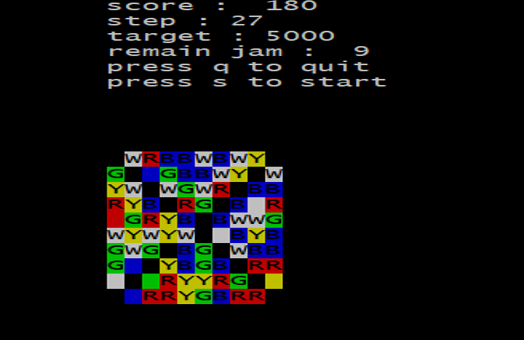

# Candy-Crush-game
## a. 說明
此為使用ncurse做成的Candy Crush小遊戲
## b. API 
### Class game_control
game_control() : 初始參數，做 ncurse 的基礎設置，呼叫開場動畫，呼叫
select()作模式選擇，呼叫該組合物件 token 的 setmode 做圖規格初始，之後呼
叫 game_loop 開始遊戲，遊戲跳出後則呼叫 game_final()。

void start_screen(int) : 此為開場動畫

void game_final() : 依照跳出遊戲原因作相對應個畫面顯示。

void game_loop() : 進入迴圈，先判斷是否達過關標準，若有，跳出迴圈，
若步數已用完也跳出迴圈，之後進行 cursor 的移動，當使用者確認兩個座標
後，將座標傳入該組合物件 token 的 game_start 中。

void select() : 讓使用者選擇模式。

### Class game_playing 
game_playing() : 初始參數。

void setmode(int ) : 依據玩家所選的模式去初始化遊戲的圖以及各類遊戲參
數

void game_start(int ,int ,int ,int) : 輸入的參數為兩個點的座標，若兩個座標
有其中之一為無效，直接回傳，若兩個座標不相鄰也直接回傳。若以上兩個條
件通過，則將兩個座標的值對調，之後呼叫 eliminating()，之後判斷 queue
eliminate 中是否為空，若是，代表無法造成消除，將兩座標值的值回復，若非
空，則呼叫 drop()，之後再呼叫 print()，然後進入 while 迴圈，再一次呼叫
eliminating，判斷是否仍有可消除，若有則繼續進行 drop 跟 print 後回到迴圈，
若無，先判斷版面是否仍有辦法進行下一次使用者的消除，若無，則重製版
面，否則跳出迴圈並將步數減一。

void print() : 一一掃描圖的每個點，依據其值及是否為 jam 印出其對應顏
色。
void generate(): 進入迴圈，將有效區域的糖果隨機，之後判斷版面是否有
辦法讓玩家進行消除且目前版面無任何連線去決定是否跳出迴圈，跳出迴圈
後，若是最一開始初始，隨機將版面產生 jam。
void drop():將 queue 的 eliminate 逐一取出，將元素逐一往下移，每次移
完一個就將頂部隨機生成一個新的糖果並將 score 加 20，而之後 print 結果並
sleep 兩秒

void eliminating() : 逐一掃瞄地圖，若為有效，先判斷該位置上下是否有一
樣的糖果，若一樣糖果超過 2，代表可消除，將可消除加入 eliminate 中，之後
判斷左右，程序同上。

bool origin_can_eliminate() : 此函示和 eliminating()大同小異，差別只在於若
一樣糖果大而二，即回傳 false。

bool is_dead() : 此函式判斷是否有辦法讓使用者進行下一次消除，而消除
規則分三個 case，參考 http://www.yanglajiao.com/article/h348592532/45332197
## c. 遊戲畫面 
 